# BackstopJS Approval Workflow Proposals

Based on your current setup with 28 visual test scenarios across 5 viewports, here are three comprehensive proposals for automating the BackstopJS approval process.

## Current State Analysis

**Current Configuration:**
- 28 Storybook scenarios tested
- 5 viewports (phone, phone-large, tablet, desktop, desktop-large)
- 0.1% mismatch threshold
- Manual approval via `yarn backstop:approve`
- Post-merge automatic approval in workflow

## Proposal 1: Smart Auto-Approval (Recommended)

Intelligent approval system that automatically approves minor changes while requiring manual review for significant ones.

```mermaid
graph TD
    A[Visual Tests Run] --> B[Analyze Diff Results]
    B --> C{Diff Analysis}
    C -->|Minor Changes| D[Auto-Approve & Commit]
    C -->|Major Changes| E[Request Manual Review]
    C -->|Critical Components| F[Block & Require Approval]
    
    D --> G[✅ Update References]
    E --> H[📝 PR Comment with Diff Summary]
    F --> I[🚫 Block PR Merge]
    
    H --> J{Developer Decision}
    J -->|Approve| K[Manual Approve Command]
    J -->|Reject| L[Fix Visual Issues]
    
    I --> M[Manual Review Required]
    M --> N{Approve Changes?}
    N -->|Yes| K
    N -->|No| L
    
    K --> O[yarn backstop:approve]
    O --> P[Commit New References]
    L --> Q[Push Fixes]
    P --> R[✅ Ready to Merge]
    Q --> A
```



### Implementation

**1. Smart Analysis Script**
```typescript
// scripts/backstop-smart-approve.ts
interface DiffAnalysis {
  severity: 'minor' | 'major' | 'critical';
  affectedComponents: string[];
  diffPercentage: number;
  criticalPaths: boolean;
}

async function analyzeVisualDiffs(): Promise<DiffAnalysis> {
  // Read backstop test results
  // Categorize changes by component importance
  // Calculate diff severity
  // Return analysis
}
```

**2. Enhanced Workflow Integration**
```yaml
# Add to backstop.yml after test step
- name: Analyze visual differences
  if: steps.detect-diffs.outputs.diffs == 'true'
  run: |
    cd front
    npx tsx scripts/backstop-smart-approve.ts analyze
    
- name: Auto-approve minor changes
  if: steps.analyze-diffs.outputs.severity == 'minor'
  run: |
    cd front
    yarn backstop:approve
    git add backstop_data/bitmaps_reference
    git commit -m "chore: auto-approve minor visual changes [skip ci]"
    git push
```

**3. Component Criticality Configuration**
```typescript
// scripts/backstop-approval-config.ts
export const componentCriticality = {
  critical: [
    'Components/Navbar',
    'Pages/HomePageHeader',
    'community/[siren]/components/FicheHeader'
  ],
  major: [
    'UI/Button',
    'Components/SearchBar',
    'Advanced Search/DataTable'
  ],
  minor: [
    'Components/TransparencyScore',
    'Test/MSWComponent'
  ]
};
```

### Advantages
- ✅ Reduces manual overhead for trivial changes
- ✅ Maintains safety for critical components
- ✅ Configurable sensitivity levels
- ✅ Preserves developer control

### Configuration Options
- Diff percentage thresholds (0.1% minor, 1% major, 5% critical)
- Component criticality mapping
- Auto-approval rules by component type

## Proposal 2: PR Command-Based Approval

Interactive approval system using PR comments and slash commands.

```mermaid
graph TD
    A[Visual Tests Fail] --> B[Post Interactive Comment]
    B --> C[📝 Show Diff Preview]
    C --> D[Developer Reviews Changes]
    D --> E{Comment Command}
    
    E -->|/approve-all| F[Approve All Changes]
    E -->|/approve Component1,Component2| G[Approve Specific Components]
    E -->|/reject| H[Request Changes]
    E -->|/review-needed| I[Request Team Review]
    
    F --> J[Run Full Approval]
    G --> K[Run Selective Approval]
    H --> L[❌ Block PR]
    I --> M[👥 Request Reviewers]
    
    J --> N[Commit All References]
    K --> O[Commit Selected References]
    L --> P[Developer Fixes Issues]
    M --> Q[Team Review Process]
    
    N --> R[✅ Ready to Merge]
    O --> S[Re-run Tests for Remaining]
    P --> T[Push Changes]
    Q --> U{Team Decision}
    
    S --> V{All Approved?}
    V -->|Yes| R
    V -->|No| W[Partial Approval State]
    T --> A
    U -->|Approve| F
    U -->|Reject| H
```



### Implementation

**1. Interactive Comment System**
```typescript
// scripts/pr-comment-handler.ts
const interactiveComment = `
## 📸 Visual Regression Test Results
⚠️ Visual differences detected in ${diffCount} scenarios

### 🎮 Interactive Approval Commands
Comment with one of these commands:

- \`/approve-all\` - Approve all visual changes
- \`/approve ComponentName1,ComponentName2\` - Approve specific components
- \`/reject\` - Reject changes and block PR
- \`/review-needed @username\` - Request team review

### 📊 Affected Components
${affectedComponents.map(c => `- ${c.name}: ${c.diffPercentage}% change`).join('\n')}

### 🔗 [View Detailed Report](${reportUrl})
`;
```

**2. Command Processing Workflow**
```yaml
# .github/workflows/backstop-commands.yml
name: Process BackstopJS Commands
on:
  issue_comment:
    types: [created]

jobs:
  process-command:
    if: github.event.issue.pull_request && startsWith(github.event.comment.body, '/')
    runs-on: ubuntu-latest
    steps:
      - name: Parse command
        id: parse
        run: |
          COMMAND="${{ github.event.comment.body }}"
          echo "command=$COMMAND" >> $GITHUB_OUTPUT
          
      - name: Execute approval
        if: startsWith(steps.parse.outputs.command, '/approve')
        run: |
          # Process approval command
          # Update references accordingly
```

### Advantages
- ✅ Clear developer control
- ✅ Selective component approval
- ✅ Team review integration
- ✅ Audit trail of decisions

## Proposal 3: Threshold-Based Auto-Approval

Configuration-driven approval based on change thresholds and component importance.

```mermaid
graph TD
    A[Visual Tests Run] --> B[Calculate Diff Metrics]
    B --> C[Apply Threshold Rules]
    C --> D{Threshold Check}
    
    D -->|Under Minor Threshold| E[✅ Auto-Approve]
    D -->|Under Major Threshold| F[⚠️ Conditional Approval]
    D -->|Over Major Threshold| G[❌ Manual Review Required]
    
    E --> H[Silent Approval]
    F --> I[Time-Delayed Approval]
    G --> J[Block PR Merge]
    
    H --> K[Update References]
    I --> L{24h Timer}
    J --> M[Manual Intervention]
    
    L -->|Timeout| N[Auto-Approve with Notice]
    L -->|Developer Action| O[Manual Decision]
    
    K --> P[✅ Tests Pass]
    N --> Q[📧 Notification Sent]
    O --> R{Approve or Reject}
    M --> S[Developer Reviews]
    
    Q --> P
    R -->|Approve| K
    R -->|Reject| T[Fix Required]
    S --> U{Decision}
    
    T --> V[Push Changes]
    U -->|Approve| K
    U -->|Reject| T
    V --> A
```



### Implementation

**1. Threshold Configuration**
```typescript
// scripts/backstop-thresholds.ts
export const approvalThresholds = {
  auto: {
    maxDiffPercentage: 0.1,
    maxAffectedScenarios: 3,
    allowedComponents: ['TransparencyScore', 'Button/Small']
  },
  conditional: {
    maxDiffPercentage: 2.0,
    maxAffectedScenarios: 8,
    timeDelayHours: 24,
    requiresNotification: true
  },
  manual: {
    minDiffPercentage: 2.0,
    criticalComponents: ['Navbar', 'FicheHeader', 'SearchBar'],
    alwaysManual: ['FicheIdentite', 'DataTable']
  }
};
```

**2. Automated Decision Engine**
```typescript
async function processApprovalDecision(testResults: BackstopResults) {
  const analysis = analyzeResults(testResults);
  
  switch (analysis.approvalLevel) {
    case 'auto':
      await autoApprove();
      await commitReferences();
      break;
      
    case 'conditional':
      await scheduleConditionalApproval(analysis.delayHours);
      await notifyDevelopers(analysis);
      break;
      
    case 'manual':
      await blockPRMerge();
      await requestManualReview(analysis);
      break;
  }
}
```

**3. Workflow Integration**
```yaml
- name: Process approval decision
  run: |
    cd front
    npx tsx scripts/process-approval.ts ${{ steps.detect-diffs.outputs.diffs }}
    
- name: Set PR status
  run: |
    gh api repos/${{ github.repository }}/statuses/${{ github.sha }} \
      --field state="${{ steps.approval.outputs.status }}" \
      --field description="${{ steps.approval.outputs.message }}"
```

### Advantages
- ✅ Fully automated for safe changes
- ✅ Configurable safety levels
- ✅ Time-based fallbacks
- ✅ No developer interruption for minor changes

## Proposal 4: Hybrid Approval System (Enterprise)

Combines all approaches with role-based permissions and advanced automation.

```mermaid
graph TD
    A[Visual Tests Run] --> B[Multi-Layer Analysis]
    B --> C[Threshold Analysis]
    B --> D[Component Criticality]
    B --> E[Historical Patterns]
    B --> F[Developer Permissions]
    
    C --> G{Smart Decision Engine}
    D --> G
    E --> G
    F --> G
    
    G -->|Auto-Approve| H[✅ Silent Approval]
    G -->|Quick Review| I[⚡ Fast Track Review]
    G -->|Standard Review| J[📋 Standard Process]
    G -->|Critical Review| K[🚨 Critical Review]
    
    H --> L[Update & Commit]
    I --> M[24h Auto-Approve]
    J --> N[PR Commands Available]
    K --> O[Team Review Required]
    
    L --> P[✅ Complete]
    M --> Q{Developer Response}
    N --> R{Command Received}
    O --> S[Manual Approval Only]
    
    Q -->|None| T[Auto-Approve with Log]
    Q -->|Override| U[Manual Decision]
    R -->|/approve| V[Execute Approval]
    R -->|/reject| W[Block & Fix]
    
    T --> L
    U --> X{Approve/Reject}
    V --> L
    W --> Y[Require Changes]
    S --> Z{Team Decision}
    
    X -->|Approve| L
    X -->|Reject| Y
    Y --> AA[Developer Fixes]
    Z -->|Approve| L
    Z -->|Reject| Y
    AA --> A
```



### Configuration System

**1. Role-Based Permissions**
```yaml
# .github/backstop-approval.yml
approval_permissions:
  auto_approve:
    - "UI/Button/*"
    - "Components/TransparencyScore/*"
    conditions:
      max_diff: 0.1%
      max_scenarios: 3
      
  quick_review:
    roles: ["frontend", "designer"]
    components:
      - "Components/SearchBar/*"
      - "Advanced Search/Filters/*"
    timeout: "24h"
    
  standard_review:
    components:
      - "Advanced Search/DataTable/*"
      - "community/[siren]/*"
    requires: "maintainer"
    
  critical_review:
    components:
      - "Components/Navbar/*"
      - "Pages/HomePageHeader/*"
    requires: ["maintainer", "designer"]
    min_approvals: 2
```

**2. Advanced Analysis Engine**
```typescript
// scripts/advanced-approval-engine.ts
interface ApprovalDecision {
  action: 'auto' | 'quick' | 'standard' | 'critical';
  confidence: number;
  reasoning: string[];
  requiredApprovers: string[];
  timeline: string;
  automation: boolean;
}

class ApprovalEngine {
  async analyze(testResults: BackstopResults): Promise<ApprovalDecision> {
    const factors = {
      diffSeverity: this.calculateDiffSeverity(testResults),
      componentCriticality: this.assessComponentCriticality(testResults),
      historicalPatterns: await this.getHistoricalData(testResults),
      developerContext: await this.getDeveloperContext(),
      businessImpact: this.assessBusinessImpact(testResults)
    };
    
    return this.makeDecision(factors);
  }
}
```

## Implementation Recommendations

### Phase 1: Quick Win (Recommended Start)
Implement **Proposal 1 (Smart Auto-Approval)** with basic threshold-based automation:

```typescript
// scripts/quick-approval.ts
export async function quickApprovalCheck(testResults: any) {
  const analysis = analyzeTestResults(testResults);
  
  // Auto-approve if:
  // - ≤3 scenarios affected
  // - ≤0.1% diff per scenario  
  // - No critical components
  // - Only UI/Button or TransparencyScore components
  
  if (shouldAutoApprove(analysis)) {
    await runCommand('yarn backstop:approve');
    await commitChanges('chore: auto-approve minor visual changes');
    return { approved: true, method: 'auto' };
  }
  
  return { approved: false, method: 'manual', analysis };
}
```

### Phase 2: Enhanced Commands
Add **Proposal 2 (PR Commands)** for developer control:

```typescript
// Add PR comment handlers
const commands = {
  '/backstop-approve': () => approveAll(),
  '/backstop-approve-component <name>': (name) => approveComponent(name),
  '/backstop-reject': () => rejectChanges(),
  '/backstop-review': () => requestReview()
};
```

### Phase 3: Enterprise Features  
Implement **Proposal 4 (Hybrid)** for complete automation with governance.

## Quick Implementation Guide

### Option A: Minimal Setup (5 minutes)
```bash
# Add simple auto-approval for tiny changes
cat >> front/package.json << 'EOF'
"backstop:smart-approve": "tsx scripts/backstop-smart-approve.ts"
EOF
```

### Option B: Full Smart System (30 minutes)  
1. Create smart approval script
2. Update GitHub workflow  
3. Configure component criticality
4. Test with sample diffs

### Option C: Interactive Commands (1 hour)
1. Implement comment parsing
2. Add command handlers
3. Create approval workflows
4. Set up permissions

## Recommended Approach

**Start with Proposal 1** for immediate benefit:

1. **Week 1**: Implement basic threshold-based auto-approval
2. **Week 2**: Add component criticality mapping  
3. **Week 3**: Integrate PR commands for manual override
4. **Month 2**: Consider full hybrid system if needed

This approach provides immediate value while allowing gradual enhancement based on your team's needs and workflow preferences.

## Configuration Examples

### Threshold-Based Rules
```yaml
# backstop-approval-rules.yml
auto_approve:
  max_diff_percentage: 0.1
  max_scenarios: 3
  allowed_components:
    - "UI/Button/*"
    - "Components/TransparencyScore/*"
    
conditional_approve:  
  max_diff_percentage: 1.0
  max_scenarios: 8
  delay_hours: 24
  notify_developers: true
  
manual_only:
  components:
    - "Components/Navbar/*"
    - "Pages/HomePageHeader/*"
    - "community/[siren]/components/FicheIdentite/*"
  always_require_review: true
```

### Command Integration
```bash
# New package.json scripts
"backstop:analyze": "tsx scripts/backstop-analyze.ts",
"backstop:auto-approve": "tsx scripts/backstop-auto-approve.ts",
"backstop:approve-component": "tsx scripts/backstop-approve-component.ts"
```

Choose the proposal that best fits your team's workflow and risk tolerance!