# Visual Regression Testing Workflows

This document outlines two different approaches for implementing visual regression testing in our project.

## Workflow 1: Current Implementation (Comment-Based)

Our current workflow uses GitHub Actions to run BackstopJS tests and posts results as PR comments.

```mermaid
graph TD
    A[PR Created/Updated] --> B[Trigger BackstopJS Workflow]
    B --> C[Setup Environment]
    C --> D[Install Dependencies]
    D --> E[Build Storybook]
    E --> F[Install Playwright]
    F --> G[Run BackstopJS Tests]
    G --> H{Visual Differences?}
    H -->|Yes| I[Upload Test Artifacts]
    H -->|No| J[✅ Tests Pass]
    I --> K[Deploy Report to GitHub Pages]
    I --> L[Check Existing PR Comments]
    L --> M{Bot Comment Exists?}
    M -->|Yes| N[Update Existing Comment]
    M -->|No| O[Create New Comment]
    N --> P[📝 Comment Updated]
    O --> P
    P --> Q[Link to Live Report]
    J --> R[🎉 No Action Needed]
```



### Advantages
- ✅ Immediate feedback in PR comments
- ✅ Persistent reports via GitHub Pages
- ✅ No duplicate comments (after our fix)
- ✅ Detailed visual comparisons
- ✅ Automatic artifact cleanup

### Disadvantages
- ❌ Requires manual review of differences
- ❌ No automatic approval/rejection
- ❌ Relies on external GitHub Pages hosting

## Workflow 2: Status Check-Based (Blocking)

Alternative workflow that uses GitHub status checks to block PRs when visual differences are detected.

```mermaid
graph TD
    A[PR Created/Updated] --> B[Trigger BackstopJS Workflow]
    B --> C[Setup Environment]
    C --> D[Install Dependencies]
    D --> E[Build Storybook]
    E --> F[Install Playwright]
    F --> G[Run BackstopJS Tests]
    G --> H{Visual Differences?}
    H -->|Yes| I[❌ Set Status Check: Failed]
    H -->|No| J[✅ Set Status Check: Passed]
    I --> K[Upload Diff Artifacts]
    I --> L[Post Comment with Instructions]
    L --> M[🚫 Block PR Merge]
    M --> N[Developer Reviews Diffs]
    N --> O{Approve Changes?}
    O -->|Yes| P[Run Approve Command]
    O -->|No| Q[Fix Visual Issues]
    P --> R[Update Reference Images]
    R --> S[Re-run Tests]
    Q --> S
    S --> G
    J --> T[✅ Allow PR Merge]
```



### Advantages
- ✅ Prevents accidental visual regressions
- ✅ Forces explicit approval of visual changes
- ✅ Integrates with GitHub's branch protection
- ✅ Clear pass/fail status

### Disadvantages
- ❌ More friction in development workflow
- ❌ Requires additional approval step
- ❌ May slow down development velocity

## Workflow 3: Hybrid Approach (Recommended)

Combines the benefits of both approaches with configurable strictness levels.

```mermaid
graph TD
    A[PR Created/Updated] --> B[Trigger BackstopJS Workflow]
    B --> C[Setup Environment]
    C --> D[Install Dependencies]
    D --> E[Build Storybook]
    E --> F[Install Playwright]
    F --> G[Run BackstopJS Tests]
    G --> H{Visual Differences?}
    H -->|No| I[✅ Set Status: Success]
    H -->|Yes| J[Analyze Diff Severity]
    J --> K{Critical Path Components?}
    K -->|Yes| L[❌ Set Status: Failed]
    K -->|No| M[⚠️ Set Status: Warning]
    L --> N[🚫 Block PR Merge]
    M --> O[💡 Allow Merge with Review]
    N --> P[Upload Detailed Reports]
    M --> P
    P --> Q[Post Smart Comment]
    Q --> R[Link to Interactive Report]
    R --> S{Developer Action}
    S -->|Approve| T[yarn backstop:approve]
    S -->|Fix| U[Fix Visual Issues]
    T --> V[Commit New References]
    U --> W[Push Changes]
    V --> X[Re-run Workflow]
    W --> X
    X --> G
    I --> Y[🎉 PR Ready to Merge]
```



### Configuration Options

#### Strictness Levels
```yaml
# In workflow file or repository settings
visual_regression:
  strictness: "hybrid" # strict | warning | hybrid
  critical_paths:
    - "components/forms/**"
    - "pages/checkout/**"
    - "components/navigation/**"
  threshold:
    pixel_diff: 0.1%
    layout_shift: 0.05%
```

#### Smart Comment Logic
- **Critical changes**: Block merge + detailed instructions
- **Minor changes**: Warning + quick approval option
- **Non-critical**: Info only + auto-approve option

### Implementation Steps

1. **Enhance current workflow** with status check integration
2. **Add configuration file** for strictness levels
3. **Implement smart comment logic** based on diff analysis
4. **Create approval automation** for non-critical changes
5. **Add component-level criticality mapping**

### Advantages
- ✅ Flexible based on change impact
- ✅ Maintains development velocity
- ✅ Protects critical user journeys
- ✅ Reduces false positive friction
- ✅ Configurable per project needs

### Implementation Priority
1. 🎯 **Phase 1**: Enhance current workflow with update-existing-comment logic ✅
2. 🎯 **Phase 2**: Add status check integration
3. 🎯 **Phase 3**: Implement diff severity analysis
4. 🎯 **Phase 4**: Add configuration-based strictness levels

## Recommendations

For your current project, I recommend:

1. **Keep the current workflow** (now fixed to prevent duplicate comments)
2. **Consider adding status checks** for critical components only
3. **Implement the hybrid approach** if visual regression becomes a frequent issue
4. **Monitor comment frequency** to determine if additional automation is needed

The fix I just implemented ensures you'll only get **one comment per PR** that updates with the latest test results, which should resolve your immediate concern.